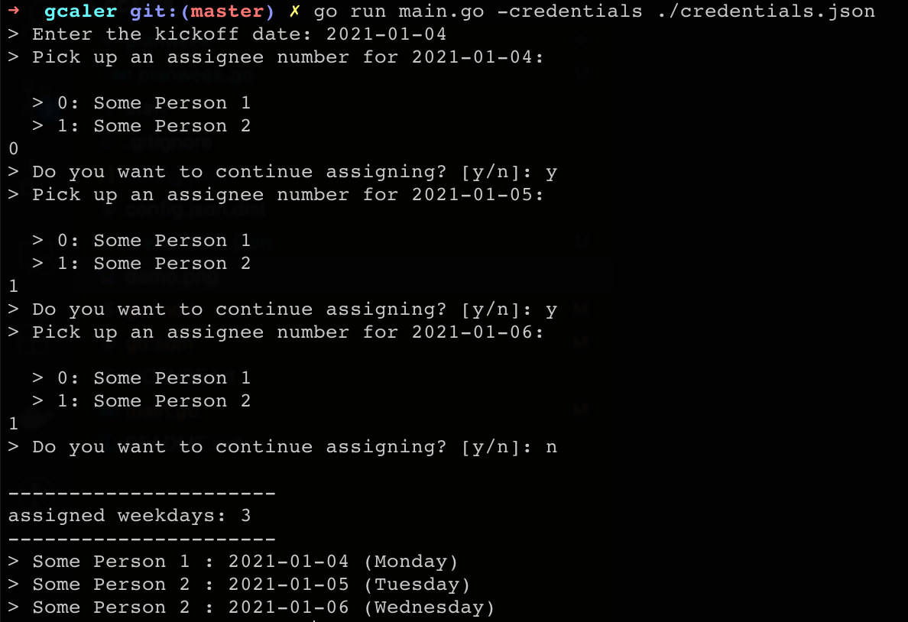

gcaler
------

The cli tool name is a concatenation of `google calendar scheduler`. The tool was created in order to quickly assign daily on-call shifts to the members of the dev team and post the schedule to the Google Calendar.

Demo
----



Set up
------

This guide implies you have successfully installed and configured [golang](https://golang.org/doc/install) on your machine.

1. Create an app in google developer console
    - follow **Step 1** from the [guide](https://developers.google.com/google-apps/calendar/quickstart/go#step_1_turn_on_the_api_name)
    - copy `client_secret.json` to the project root

After the first run the google access token will cached in `$HOME/.gcaler/access_token.json`

2. Configure your app

```bash
# 1: create a config
cp config.json.dist config.json

# 2: modify config.json contents with your data
```

3. Run `go install`

4. Run `gcaler` to start using the cli tool

```bash
$ gcaler -help

# provide custom configs location; defauls are in the bin working dir
$ gcaler -config /path/to/config.json -credentials /path/to/google/credentials.json
```

License
-------
See the [LICENSE](LICENSE.txt) file for license rights and limitations (MIT).
